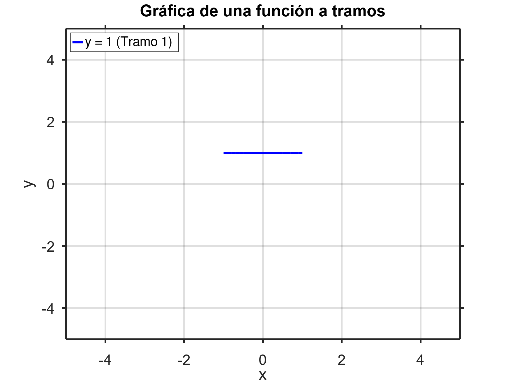
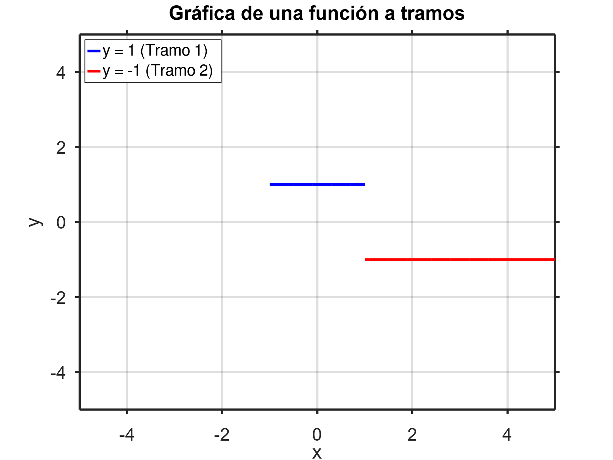
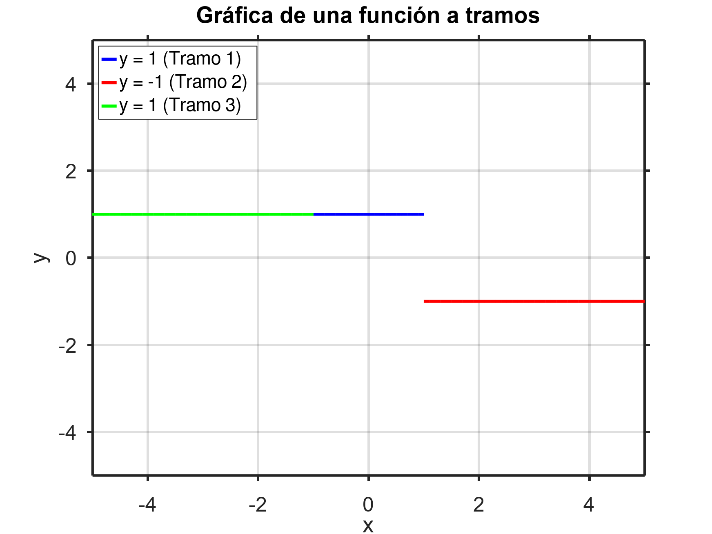
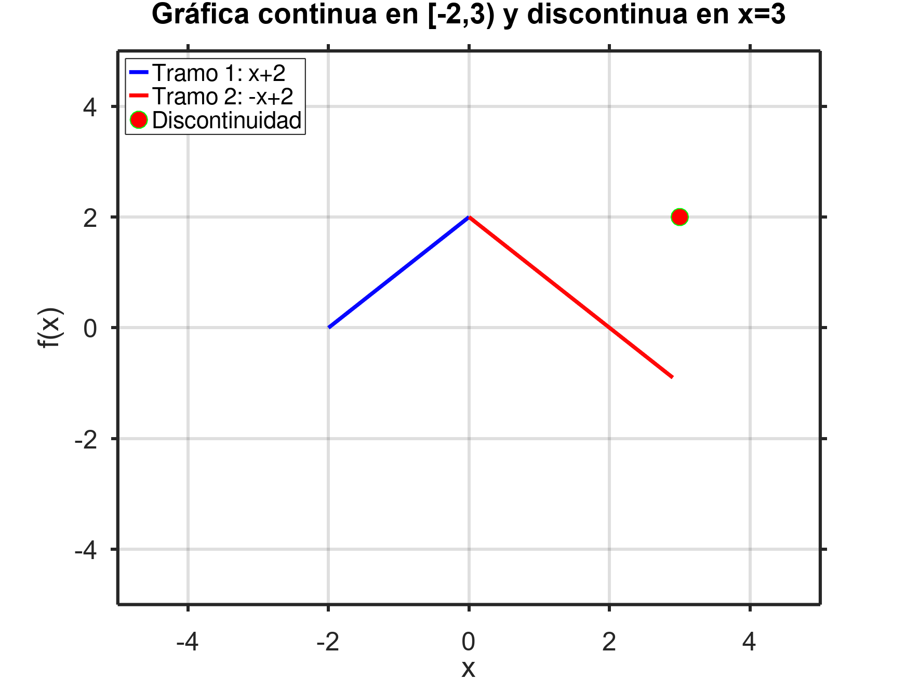

# 📘 Ejercicios

En este ejercicio se mezclan un montón de temas: gráficas de funciones, límites y paridad de funciones. Es lindo y raro, como un perro verde. Pero tiene su encanto, ¿no? Vamos directo al enunciado.

## Graficar funciones que verifiquen:
1. $f(x)$ continua en $[−2, 3]$, $f(x) > 0$ en $(−1, 1)$ y discontinua en $x = 3$.
2. $g(x)$ impar, con una discontinuidad inevitable en $x = 2$, una discontinuidad evitable en $x = 3$ y $\lim_{x \to \infty} g(x) = 5$.
3. $h(x)$ par, continua y positiva en $[0, 1]$, $\lim_{x \to 1^+} h(x) = −2$, $h(3) = −2$ y con una discontinuidad evitable en $x = 3$.

## Antes de comenzar
Ojo, van a ser funciones **a tramos** sí o sí, porque nos están pidiendo discontinuidades inevitables, y esas aparecen generalmente como **saltos** o **asíntotas**.

-a-tramos.png)

**Figura 1:** Gráfico de una función a tramos inventada por mí. Fijate que los tramos en azul son una hipérbola $y = \frac{1}{x+15}$, pero el resto de la función tiene otra definición.

Con este pequeño tip... ¡vamos a _laburar, loco_!

---

## 1. Función $f(x)$

Queremos que:
- Sea continua en $[-2,3]$.
- Cumpla que $f(x) > 0$ en $(−1, 1)$.
- Tenga una discontinuidad en $x = 3$.

### Primer tramo
Arranquemos con $f(x) > 0$ en $(-1,1)$.  
Para no complicarnos la vida, podemos dibujar una recta constante: $f(x) = 1$ en ese intervalo.

**Figura 2:** Empezamos con $y=1$. ¿Por qué tan simple? Porque la vida ya es bastante complicada, pa. Y además, cumple con lo que nos piden.

### Segundo tramo
Ahora agregamos la discontinuidad en $x = 3$.  
Una forma sencilla es hacer un salto en la gráfica, por ejemplo bajando a $y=-1$.

**Figura 3:** Metemos un salto. Ojo, podés elegir otro valor distinto de $-1$ si querés, siempre que no sea $1$, porque ahí ya no sería una discontinuidad real.

### Tercer tramo
Finalmente, como debe ser continua en $[-2,3]$ (excepto en $x=3$), extendemos $f(x) = 1$ hacia la izquierda hasta $x = -\infty$.

¿Es esta la única solución? **No**.  
Podés inventar mil versiones diferentes mientras respeten las condiciones. Por ejemplo:

---

## 2. Función $g(x)$

Ahora nos toca una función:
- Impar.
- Con una discontinuidad inevitable en $x=2$.
- Una discontinuidad evitable en $x=3$.
- Y que $\lim_{x \to \infty} g(x) = 5$.

Al ser impar, vamos a trabajar primero para $x>0$ y después reflejar todo para $x<0$.

### Parte positiva

Para la discontinuidad evitable en $x=3$, basta con que el valor de $g(3)$ no coincida con el límite lateral.

Y para cumplir el límite en infinito, pensamos en una función que tienda a 5, como $f(x) = 5 + \frac{1}{x-2}$.

Esta función, además, tiene una asíntota vertical en $x=2$ (perfecta para la discontinuidad inevitable que nos piden).

Con $x \in (2,3)$ y $x>3$ usaríamos esa hipérbola desplazada.

Entre $x=0$ y $x=2$, para algo fácil, podemos usar la recta $y=x$.

### Parte negativa

Ahora reflejamos todo para que sea impar.  
- La recta $y=x$ ya es impar, no hay problema.
- La hipérbola debe reflejarse también, pasando de $5+\frac{1}{x-2}$ a $-5+\frac{1}{x+2}$.
- Los puntos aislados también se reflejan respetando $f(-x) = -f(x)$.

Así nos queda:

$$
g(x) = 
\begin{cases}
-5 + \frac{1}{x+2}, & \text{si} \quad x \in (-\infty, -3) \cup (-3, -2) \\
-2, & \text{si} \quad x = -3 \\
x, & \text{si} \quad -2 \leq x \leq 2 \\
2, & \text{si} \quad x = 3 \\
5 + \frac{1}{x-2}, & \text{si} \quad x \in (2,3) \cup (3, \infty)
\end{cases}
$$

.png)

---

## 3. Función $h(x)$

Finalmente tenemos:
- Una función par.
- Continua y positiva en $[0,1]$.
- $\lim_{x \to 1^+} h(x) = -2$.
- $h(3) = -2$.
- Discontinuidad evitable en $x=3$.

Podríamos definir:

- En $[-1,1]$ usamos $h(x) = |x|$ (positivo y par, check).
- En $(1,2)$ y $(2,3)$ ponemos rectas que conecten de forma razonable (por ejemplo, una pendiente positiva o negativa).
- En $x=3$, ajustamos para que $h(3) = -2$ pero no coincida con el límite.

Y para respetar la paridad, reflejamos todo hacia la izquierda.

Una propuesta concreta sería:

$$
h(x) = 
\begin{cases}
-x-3, & \text{si} \quad x \in (-\infty, -3) \cup (-3, -1) \\
-2, & \text{si} \quad x = -3 \\
|x|, & \text{si} \quad x \in [-1,1] \\
-2, & \text{si} \quad x = 3 \\
x-3, & \text{si} \quad x \in (1,3) \cup (3, \infty)
\end{cases}
$$

.png)

---

Taraaaaán 👍
