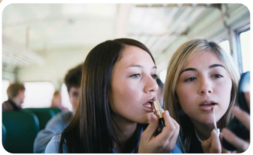

# 📅 Week 1. Tuesday, April 1, 2025 (Class 1)
Solo avisos administrativos y de organización de la materia.

# 📅 Week 1. Thursday, April 3, 2025 (Class 2)

---

# 🧠 **Class Content**

## Title of Unit 1 - **Becoming Culturally Literate**

### Warm-Up : Are these people going anything wrong? If so, what?

The problem that we see in this pictures is the manspreading because invade the other’s personal space. Sometime this behavior is annoying. Often we see that on a bus, train or subway.

Putting on lipstick on the isn’t that bad. What’s worse is talking loudly or playing music on speaker.

An alternative is 
Wearing lipstick on the bus isn’t a big deal. It’s much worse when people talk loudly or play music on a speaker.

| **Title** | **Used for** | **Pronunciation** | **Marital Status** | **Example** |
| --- | --- | --- | --- | --- |
| Mr. | Any man | /ˈmɪstər/ | Doesn’t matter | Mr. Smith (John Smith) |
| Mrs. | Married woman | /ˈmɪsɪz/ | **Married** | Mrs. Johnson (Anna Johnson, married) |
| Miss | Young or unmarried woman | /mɪs/ | **Unmarried** | Miss Taylor (Emily Taylor, single) |
| Ms. | Any woman (Formal/neutral) | /mɪz/ | Doesn’t specify (unknown or private) | Ms. Brown (could be married or not) |

---

### 📚 **New Vocabulary**

| Word / Phrase | Meaning | Example Sentence |
| --- | --- | --- |
| In real life | To meet with other people physically; in person. |  |
| rarely | not often | -  She rarely eats meat. |
| needs to get a handle on | to gain control or understanding of something | -  She needs to get a handle on her time management skills. (She needs to improve or take control of how she manages her time.) -  He needs to get a handle on the new software.(He needs to understand and learn how to use the new software better.) |

---